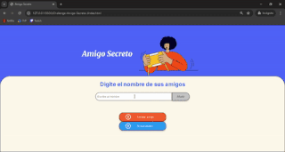

<h1>✨Challenge Amigo Secreto✨</h1>

Este proyecto se realizo para el programa **Oracle Next Education+Alura LATAM**. Con el fin de fortalecer el pensamiento logico, mejorar el análisis y la resolucion de problemas, usando JavaScript, HTML y CSS.

<h2>📝 Descripción</h2>
En este desafío desarrollamos una aplicación web que permite a los usuarios ingresar nombres de amigos en un formato de lista y sortear un nombre de manera Aleatoria.

El usuario deberá colocar nombres mediante un campo de texto clickeando el boton "Adicionar". Dichos nombres seran visibles en la pagina en disposicion de lista uno abajo del otro. Luego se tendra que presionar el boton "Sortear Amigo" y saldra a disposicion un mensaje con el amigo seleccionado aleatoriamente. Este mensaje solo se mostrará 3 segundos para que los demas participantes en la sala no puedan ver el que le toco a cada miembro.

Habrá un boton "Nuevo sorteo" para que se pueda realizar las veces que se deseé.

## ⚙️ Funcionalidades

- **Agregar participantes**  
  El usuario puede escribir un nombre en el campo de texto y presionar el botón Adicionar para añadirlo a la lista de amigos.  
  - No se permiten campos vacíos.  
  - Los nombres se muestran en una lista debajo del campo de entrada.

- **Evitar duplicados**  
  Si un nombre ya fue ingresado, el sistema no lo agregará nuevamente para evitar repeticiones.

- **Sorteo aleatorio**  
  Al presionar el botón Sortear Amigo, la aplicación selecciona un nombre al azar de la lista.  
  - El resultado se muestra en pantalla durante **3 segundos** y luego desaparece para mantener el secreto.  
  - Esto permite que cada participante conozca su amigo secreto sin que los demás lo vean.

- **Reiniciar sorteo**  
  Con el botón Nuevo sorteo:
  - Se vacía la lista de amigos ingresados.  
  - Se limpia el mensaje de resultado.  
  - La aplicación queda lista para comenzar una nueva ronda.

- **Interfaz amigable y responsive**  
  - Colores definidos con variables CSS para fácil personalización.  
  - Botones con estados *hover* y estilo moderno.  
  - Compatible con dispositivos móviles y escritorio.
 
  ## 📂 Tecnologías utilizadas
- **HTML5** – Estructura de la página
- **CSS3** – Estilos y diseño
- **JavaScript (ES6)** – Lógica y funcionalidad

<h2>🎥Demo </h2>

